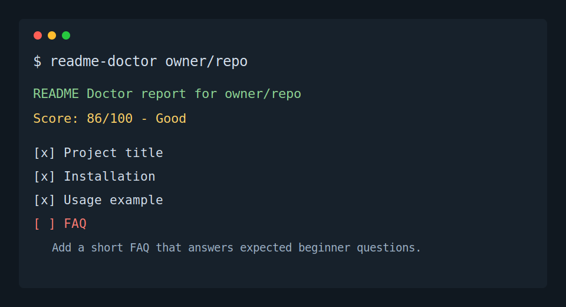

# README Doctor

[](https://github.com/yunxi067/readme-doctor/actions/workflows/test.yml)
[](https://www.npmjs.com/package/@yunxi067/readme-doctor)
[](./LICENSE)

[English](#english) | [中文](#中文)

README Doctor is a small CLI that audits a GitHub repository README for the essentials that help open source visitors trust and use a project.

README Doctor 是一个轻量级命令行工具，用来检查 GitHub 仓库的 README 是否包含开源项目常见的关键信息，帮助新访客更快理解、安装和使用项目。



## English

## Installation

Run with npx:

```bash
npx @yunxi067/readme-doctor octocat/Hello-World
```

Run it directly from the repository:

```bash
git clone https://github.com/yunxi067/readme-doctor.git
cd readme-doctor
npm install
```

## Usage

Audit a public GitHub repository:

```bash
npx @yunxi067/readme-doctor octocat/Hello-World
```

Or run the CLI file directly:

```bash
node src/cli.js https://github.com/octocat/Hello-World
```

Print JSON for scripts:

```bash
node src/cli.js octocat/Hello-World --json
```

## What It Checks

README Doctor scores seven beginner-friendly README essentials:

- project title
- installation instructions
- usage example
- screenshot, GIF, video, or demo link
- license
- contributing guidance
- FAQ

Each item has equal weight. The CLI prints the score, passed checks, and focused suggestions for missing sections.

## GitHub API

README Doctor uses GitHub REST API endpoints for repository metadata, README content, and license metadata. Set `GITHUB_TOKEN` if you want higher API rate limits:

```bash
GITHUB_TOKEN=ghp_your_token_here node src/cli.js owner/repo
```

## FAQ

### Does it modify the target repository?

No. It only reads public GitHub API data and prints a local report.

### Can it audit private repositories?

Yes, if `GITHUB_TOKEN` has access to the private repository.

### Why does screenshot/demo count as a README essential?

For small tools, one visual proof point helps new visitors understand the project quickly.

## Contributing

Issues and pull requests are welcome. See [CONTRIBUTING.md](./CONTRIBUTING.md) for the small development workflow.

## Release Notes

See [CHANGELOG.md](./CHANGELOG.md).

## License

MIT

## 中文

## 安装

使用 npx 直接运行：

```bash
npx @yunxi067/readme-doctor octocat/Hello-World
```

从 GitHub 克隆项目并安装依赖：

```bash
git clone https://github.com/yunxi067/readme-doctor.git
cd readme-doctor
npm install
```

## 使用

检查一个公开 GitHub 仓库：

```bash
npx @yunxi067/readme-doctor octocat/Hello-World
```

也可以直接运行 CLI 文件：

```bash
node src/cli.js https://github.com/octocat/Hello-World
```

输出适合脚本读取的 JSON：

```bash
node src/cli.js octocat/Hello-World --json
```

## 检查内容

README Doctor 会检查 7 个对开源新访客很重要的 README 要素：

- 项目标题
- 安装说明
- 使用示例
- 截图、GIF、视频或演示链接
- License
- 贡献方式
- 常见问题 FAQ

每一项权重相同。CLI 会输出总分、已通过项目，以及缺失项目的改进建议。

## GitHub API 说明

README Doctor 会通过 GitHub REST API 读取仓库信息、README 内容和 License 元数据。如果你想提高 API 速率限制，可以设置 `GITHUB_TOKEN`：

```bash
GITHUB_TOKEN=ghp_your_token_here node src/cli.js owner/repo
```

## 常见问题

### 它会修改被检查的仓库吗？

不会。它只读取 GitHub API 数据，并在本地输出报告。

### 可以检查私有仓库吗？

可以，只要 `GITHUB_TOKEN` 有访问该私有仓库的权限。

### 为什么截图或演示也算 README 必备项？

对于小工具项目，一个截图、GIF 或演示链接能让新访客更快判断项目是否值得尝试。

## 参与贡献

欢迎提交 issue 或 pull request。开发流程可以查看 [CONTRIBUTING.md](./CONTRIBUTING.md)。

## 版本记录

查看 [CHANGELOG.md](./CHANGELOG.md)。

## 许可证

MIT
